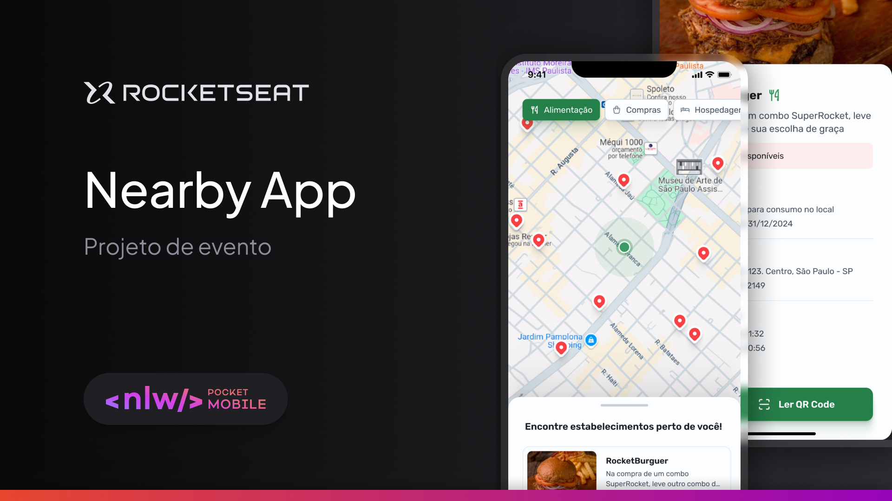

# Nearby App 📍

The **Nearby App** is a mobile application that simplifies access to discount coupons at nearby establishments. With Nearby, users can navigate an interactive map, find nearby locations, and select the desired place to get exclusive discounts. By scanning the QR Code available at the establishment, users automatically receive the discount code, making the process simple, fast, and efficient.

## Features 🌟

- **Location Services**: Identifies nearby establishments based on your current location.
- **Interactive Map**: Displays establishments on a map for easy navigation.
- **Discount Coupons**: Enables users to redeem exclusive coupons by scanning QR Codes at participating establishments.

## Technologies Used 🛠️

- **React Native**: For building the app with Expo.
- **Tailwind CSS**: A utility-first styling framework used with [NativeWind](https://www.nativewind.dev/).
- **TypeScript**: For safer and more reliable code.
- **Map View**: For displaying interactive maps within the app. [Documentation](https://github.com/react-native-maps/react-native-maps)
- **Expo Camera**: Integration with the device's camera for scanning QR Codes. [Documentation](https://docs.expo.dev/versions/latest/sdk/camera/)
- **React Native Bottom Sheet**: A component for displaying information in a sliding modal. [Documentation](https://github.com/gorhom/react-native-bottom-sheet)
- **Tabler Icons**: A library of customizable interface icons. [Documentation](https://tabler-icons.io/)

---

## Nearby App

